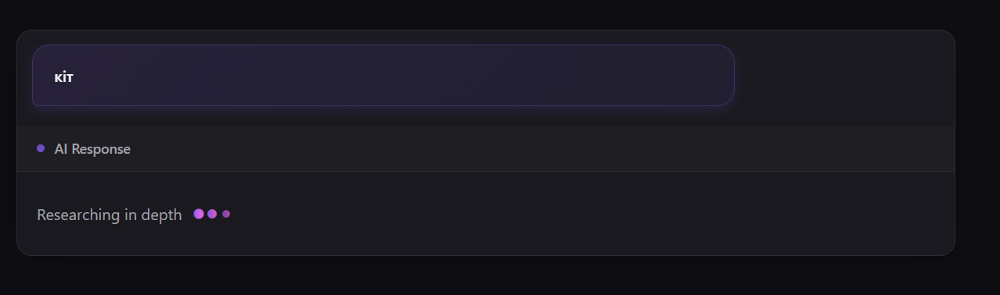
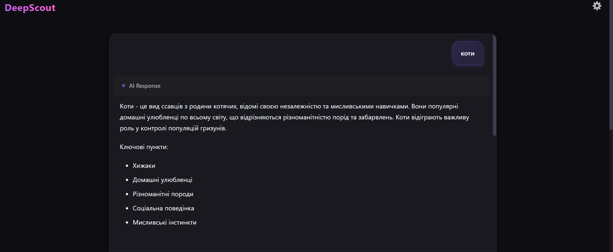
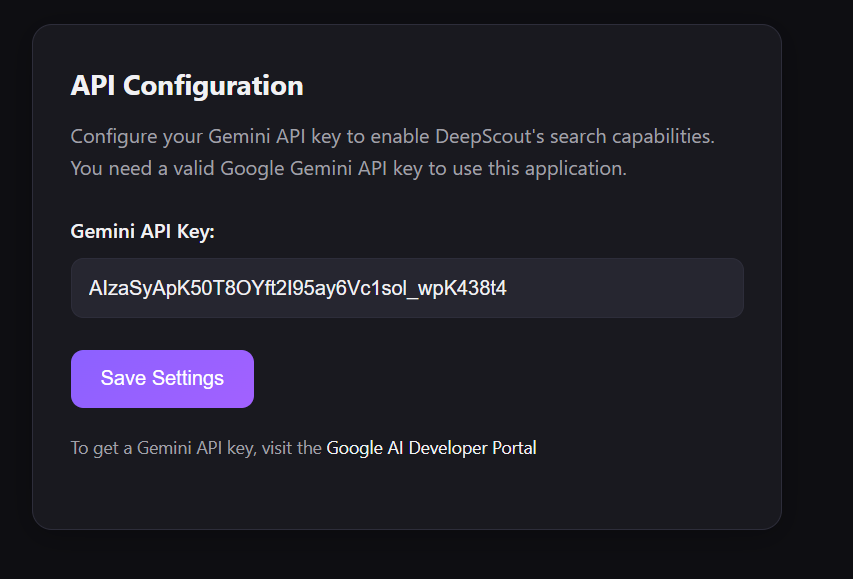

# DeepScout 🔍🤖

<div align="center">


**AI-Powered Search Application with Deep Research Capabilities**

[](https://python.org)
[](https://flask.palletsprojects.com)
[](https://ai.google.dev)

</div>

DeepScout - це інтелектуальний веб-додаток для пошуку та аналізу інформації з використанням штучного інтелекту Google Gemini. Він поєднує швидкість звичайного пошуку з глибиною дослідження, забезпечуючи користувачам комплексні та детальні відповіді на їхні запитання.

## ✨ Ключові особливості

### 🔍 Двохрежимний пошук
- **Звичайний пошук**: Швидкі та точні відповіді з використанням ШІ для повсякденних запитань
- **Глибокий пошук (Deep Research)**: Детальний аналіз з множинних джерел для складних тем

### 🎯 Інтелектуальні можливості
- **Контекстуальні відповіді**: ШІ розуміє контекст та надає релевантну інформацію
- **Уточнюючі питання**: Можливість продовжувати розмову з додатковими питаннями
- **Фільтрація off-topic**: Автоматичне визначення та обробка питань поза темою

### 💫 Сучасний інтерфейс
- **Анімації завантаження**: Елегантні спінери та індикатори прогресу
- **Адаптивний дизайн**: Оптимізація для всіх типів пристроїв
- **Інтуїтивна навігація**: Зручний та зрозумілий інтерфейс користувача

### 📚 Управління даними
- **Історія розмов**: Автоматичне збереження та можливість продовження діалогів
- **База даних**: Ефективне зберігання результатів пошуку
- **Безпека**: Захищене зберігання API ключів

## 📸 Скріншоти додатку

### 🏠 Генерація відповіді
<div align="center">

<p><em>Загрузка відповіді</em></p>
</div>

### 🔍 Результати звичайного пошуку
<div align="center">

<p><em>Швидкі відповіді ШІ з можливістю додаткових питань</em></p>
</div>

### 📎 Поле вводу
<div align="center">

<p><em>Поле з вводом для веб-парсеру</em></p>
</div>

### ⚙️ Сторінка налаштувань
<div align="center">

<p><em>Налаштування API ключа Google Gemini</em></p>
</div>

## 🚀 Швидкий старт

### Передумови
- Python 3.8 або новіша версія
- Інтернет-з'єднання для доступу до API
- Веб-браузер (Chrome, Firefox, Safari, Edge)

## ⚙️ Встановлення та налаштування

### 1️⃣ Клонування репозиторію
```bash
git clone <посилання-на-репозиторій>
cd DeepScout
```

### 2️⃣ Встановлення залежностей

**⚡ Рекомендується використовувати віртуальне середовище:**

```bash
# Створення віртуального середовища
python -m venv venv

# Активація віртуального середовища
# На Windows (PowerShell):
venv\Scripts\Activate.ps1
# На Windows (Command Prompt):
venv\Scripts\activate.bat
# На macOS/Linux:
source venv/bin/activate

# Встановлення залежностей
pip install -r requirements.txt
```

> **💡 Примітка**: У разі проблем з правами виконання в PowerShell, виконайте:
> ```powershell
> Set-ExecutionPolicy -ExecutionPolicy RemoteSigned -Scope CurrentUser
> ```

### 3️⃣ Налаштування API ключа Google Gemini

**🔑 ВАЖЛИВО:** Кожен користувач повинен створити свій власний API ключ!

#### 🔗 Крок 1: Отримання API ключа
1. Перейдіть на [Google AI Studio](https://aistudio.google.com/app/apikey)
2. Увійдіть у свій Google акаунт
3. Натисніть **"Create API Key"**
4. Скопіюйте згенерований ключ

#### ⚙️ Крок 2: Налаштування ключа в проєкті

**🌟 Варіант A: Через веб-інтерфейс (рекомендується)**
1. Запустіть проєкт: `python app.py`
2. Відкрийте в браузері: [http://127.0.0.1:5000/settings](http://127.0.0.1:5000/settings)
3. Вставте ваш API ключ і натисніть **"Зберегти"**

**📁 Варіант B: Вручну**
1. Створіть папку `config/` у кореневій директорії проєкту
2. Створіть файл `config/api_key.txt`
3. Вставте в нього ваш API ключ (без лишніх пробілів)

**🔧 Варіант C: Змінна середовища**
```bash
# На Windows (PowerShell):
$env:GOOGLE_API_KEY="ваш_api_ключ_тут"

# На macOS/Linux:
export GOOGLE_API_KEY="ваш_api_ключ_тут"
```

### 4️⃣ Запуск додатку

```bash
python app.py
```

🎉 **Додаток буде доступний за адресою:** [http://127.0.0.1:5000](http://127.0.0.1:5000)

## 📖 Керівництво користувача

### 🔍 Основні функції

#### 1. **Звичайний пошук**
- Введіть ваше запитання у пошукове поле
- Натисніть кнопку **"Search"** або клавішу `Enter`
- Отримайте швидку та точну відповідь від ШІ

#### 2. **Глибокий пошук (Deep Research)**
- Увімкніть перемикач **"Deep Research"**
- Введіть складне запитання для детального аналізу
- ШІ проведе комплексне дослідження з множинних джерел

#### 3. **Уточнюючі питання**
- Після отримання відповіді з'являється форма для додаткових питань
- Ставте питання в контексті поточної розмови
- ШІ автоматично визначить, чи пов'язане питання з темою

#### 4. **Управління розмовою**
- Використовуйте кнопку **"Clear"** для початку нової розмови
- Історія зберігається автоматично
- Можливість продовження попередніх діалогів

### 🎯 Поради для ефективного використання

**✅ Для кращих результатів:**
- Формулюйте запитання чітко та конкретно
- Використовуйте ключові слова, що стосуються вашої теми
- У Deep Research режимі вказуйте контекст для більш глибокого аналізу

**⚠️ Обмеження:**
- ШІ може відмовитися відповідати на питання поза темою поточної розмови
- Деякі запитання можуть потребувати нової розмови для кращих результатів

## 📁 Структура проєкту

```
DeepScout/
├── 📄 README.md                  # Документація проєкту
├── 📋 requirements.txt           # Python залежності
├── 📊 plan.md                    # План розробки
├── 🐍 app.py                     # Головний Flask додаток
├── 🗄️ database.py                # SQLAlchemy моделі
├── 🔍 search.py                  # Логіка пошуку та ШІ
├── 🛠️ utils.py                   # Допоміжні функції
├── 💾 deepscout.db               # SQLite база даних
├── 📁 config/                    # Конфігураційні файли
│   └── 🔑 api_key.txt           # API ключ Google Gemini
├── 📁 static/                    # Статичні ресурси
│   ├── 🎨 style.css             # CSS стилі
│   ├── 🧠 brains.png            # Логотип додатку
│   ├── 🗑️ clear.png             # Іконка очищення
│   ├── ⚙️ gear.png              # Іконка налаштувань
│   ├── 🌐 default-favicon.png   # Фавікон
│   └── 📸 *.png                 # Скріншоти додатку
├── 📁 templates/                 # HTML шаблони
│   ├── 🏠 index.html            # Головна сторінка
│   ├── 📋 results.html          # Результати пошуку
│   ├── 💬 response_section.html # Секція відповідей
│   └── ⚙️ settings.html         # Сторінка налаштувань
├── 📁 utils/                     # Додаткові утиліти
│   └── 📝 markdown_convert.py   # Конвертер Markdown
└── 📁 __pycache__/              # Python кеш файли
```

### 🏗️ Архітектура додатку

- **Frontend**: HTML/CSS/JavaScript з адаптивним дизайном
- **Backend**: Flask веб-фреймворк з RESTful API
- **База даних**: SQLAlchemy ORM з SQLite
- **ШІ**: Інтеграція з Google Gemini API
- **Веб-скрейпінг**: Selenium + BeautifulSoup для збору даних

## 🔒 Безпека та конфіденційність

### 🛡️ Захист API ключів
- API ключі **НЕ** зберігаються в Git репозиторії
- Файл `config/api_key.txt` автоматично додається в `.gitignore`
- Кожен розробник створює свій власний API ключ
- Підтримка змінних середовища для додаткової безпеки

### 🔐 Рекомендації з безпеки
- **Ніколи не діліться** своїм API ключем
- Регулярно оновлюйте API ключі
- Використовуйте різні ключі для різних середовищ (dev/prod)
- Моніторьте використання API через Google Cloud Console

## 🐛 Усунення неполадок

### ❗ Поширені проблеми та рішення

#### 🔑 **Проблеми з API ключем**
```bash
# Помилка: "API key not found" або "Invalid API key"
# Рішення:
1. Перевірте, чи існує файл config/api_key.txt
2. Переконайтеся, що ключ не містить пробілів
3. Створіть новий API ключ на https://aistudio.google.com/app/apikey
```

#### 🐍 **Помилки імпорту Python**
```bash
# Помилка імпорту SQLAlchemy на macOS:
pip uninstall sqlalchemy
pip install sqlalchemy

# Загальні проблеми з залежностями:
pip install --upgrade pip
pip install -r requirements.txt --force-reinstall
```

#### 🌐 **Проблеми з веб-драйвером**
```bash
# Помилки Selenium/ChromeDriver:
pip install --upgrade webdriver-manager

# Якщо Chrome не знайдено:
# Встановіть Google Chrome або оновіть до останньої версії
```

#### 🔌 **Проблеми з мережею**
```bash
# Помилка підключення до API:
1. Перевірте інтернет-зʼєднання
2. Переконайтеся, що API ключ активний
3. Перевірте ліміти використання API

# Тайм-аути запитів:
# Збільшіть timeout в search.py або спробуйте пізніше
```

#### ⚡ **Проблеми з продуктивністю**
```bash
# Повільні відповіді:
1. Перевірте швидкість інтернету
2. Використовуйте звичайний замість глибокого пошуку
3. Очистіть кеш браузера

# Високе використання пам'яті:
# Перезапустіть додаток: Ctrl+C, потім python app.py
```

### 🔧 **Режим відлагодження**
```bash
# Запуск з детальними логами:
export FLASK_ENV=development  # macOS/Linux
$env:FLASK_ENV="development"  # Windows PowerShell
python app.py
```

## 🛠️ Технологічний стек

### Backend
- **🐍 Python 3.8+**: Основна мова програмування
- **🌶️ Flask 2.0+**: Веб-фреймворк для створення API та маршрутизації
- **🗄️ SQLAlchemy**: ORM для роботи з базою даних
- **💾 SQLite**: Легка база даних для зберігання історії

### AI & Machine Learning
- **🤖 Google Gemini API**: Штучний інтелект для обробки запитів
- **🔍 DuckDuckGo Search**: Пошукова система для збору даних
- **🕷️ Selenium**: Автоматизація веб-браузера для скрейпінгу
- **🥣 BeautifulSoup**: Парсинг HTML контенту

### Frontend
- **🌐 HTML5**: Структура веб-сторінок
- **🎨 CSS3**: Стилізація та адаптивний дизайн
- **⚡ JavaScript (ES6+)**: Інтерактивність та AJAX запити
- **📱 Responsive Design**: Підтримка всіх пристроїв

### DevOps & Tools
- **📦 pip**: Менеджер пакетів Python
- **🔧 venv**: Віртуальні середовища Python
- **📋 Git**: Система контролю версій
- **🔒 .gitignore**: Захист конфіденційних файлів

## 🤝 Внесок у розробку

### 📝 Як додати нову функцію

1. **Форкніть репозиторій**
2. **Створіть нову гілку:**
   ```bash
   git checkout -b feature/amazing-feature
   ```
3. **Внесіть зміни та зробіть коміт:**
   ```bash
   git commit -m "Add amazing feature"
   ```
4. **Відправте зміни:**
   ```bash
   git push origin feature/amazing-feature
   ```
5. **Створіть Pull Request**

### 🐛 Звіти про помилки
- Використовуйте [Issues](../../issues) для звітів про баги
- Додайте детальний опис проблеми
- Включіть кроки для відтворення помилки
- Зазначте версію Python та ОС

### 💡 Пропозиції покращень
- Створіть новий Issue з міткою "enhancement"
- Опишіть бажану функціональність
- Поясніть, як це покращить додаток

## 📊 Статистика проєкту

- **Мови програмування**: Python, HTML, CSS, JavaScript
- **Рядків коду**: ~2000+
- **Файлів**: 15+
- **Залежностей**: 10+
- **Підтримуваних платформ**: Windows, macOS, Linux

## 🎓 Навчальні цілі

Цей проєкт демонструє:
- **Веб-розробку** з Flask
- **Інтеграцію AI API** (Google Gemini)
- **Роботу з базами даних** (SQLAlchemy)
- **Frontend розробку** (HTML/CSS/JS)
- **Веб-скрейпінг** (Selenium/BeautifulSoup)
- **Git workflow** та командну роботу
- **Безпеку** API ключів та конфіденційних даних

## 🔨 Автори та мета

**Розроблено для курсу**: "Technologies For Data Collection And Processing"

## 👥 Автори:
 - Гайдук Максим Олександрович
 - Бороденко Роман Андрійович


## 🎯 Академічна мета
Проєкт створений як практичне застосування сучасних технологій:
- Збір та обробка даних
- Машинне навчання та AI
- Веб-розробка full-stack
- Інтеграція зовнішніх API

## 📄 Ліцензія

```
MIT License

Copyright (c) 2025 DeepScout Team

Цей проєкт створений для навчальних цілей в рамках курсу
"Technologies For Data Collection And Processing".

Дозволяється вільне використання, модифікація та поширення
коду з освітньою метою.

THE SOFTWARE IS PROVIDED "AS IS", WITHOUT WARRANTY OF ANY KIND.
```

---

<div align="center">

**📞 Підтримка**

Якщо у вас виникли питання або проблеми, створіть [Issue](../../issues) або зв'яжіться з командою розробки.

**⭐ Сподобався проєкт?**

Поставте зірочку ⭐ та поділіться з друзями!

---

*Зроблено з ❤️ для навчання та розвитку*

</div>
